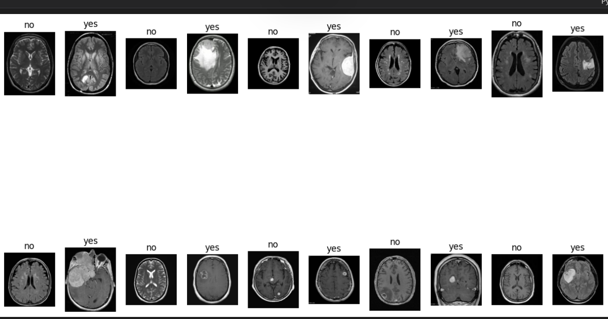
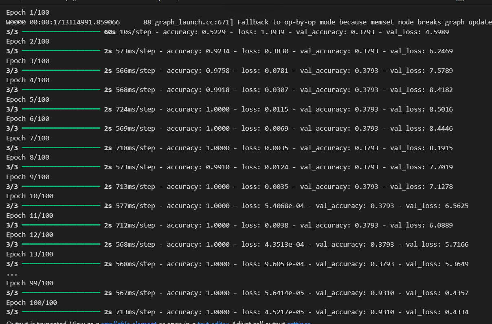
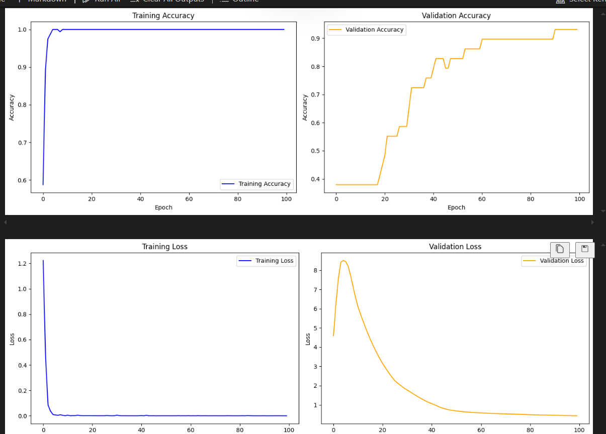
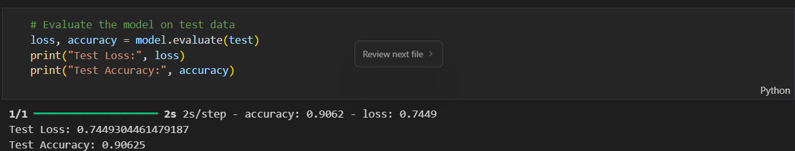
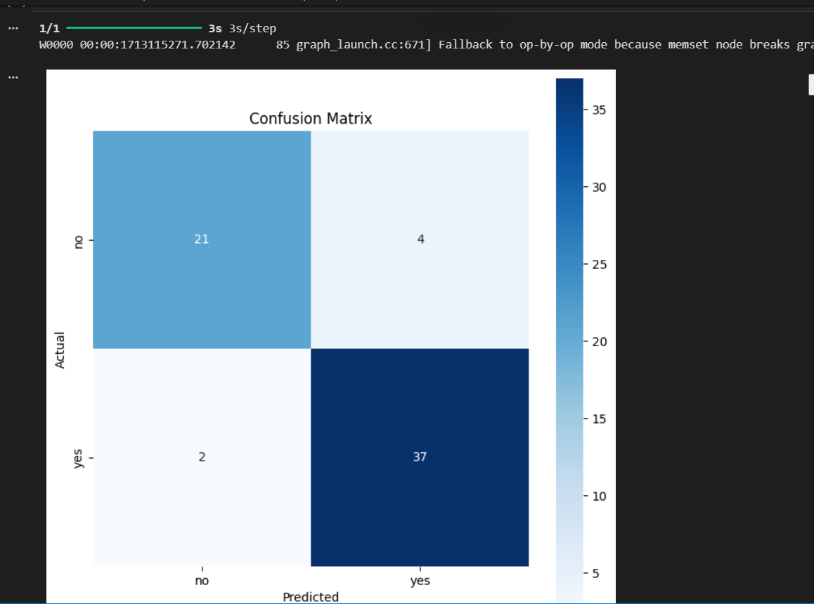

# Brain Tumor Detection using Xception Model

This project implements a deep learning model for brain tumor detection using MRI images. The model is based on the Xception architecture, which is a powerful convolutional neural network known for its efficiency and accuracy in image classification tasks.

## Project Overview

The goal of this project is to classify brain MRI images into two categories:
- Tumor present
- No tumor present

The model uses transfer learning with the Xception architecture, which is pre-trained on ImageNet, and fine-tunes it for the specific task of brain tumor detection.

## Dataset

The project uses a dataset of brain MRI images from Kaggle. The dataset is split into:
- Training set: 160 images
- Validation set: 29 images
- Test set: 64 images

### Data Visualization

## Implementation Details

### Data Preprocessing
- Images are resized to 299x299 pixels (Xception's input size)
- Data augmentation techniques are applied:
  - Random rotation
  - Width and height shifts
  - Horizontal flip
  - Zoom
  - Brightness adjustment
- Images are normalized to [0,1] range

### Model Architecture
The model uses the Xception architecture with the following modifications:
- Base model: Xception (pre-trained on ImageNet)
- Global Average Pooling layer
- Dense layer with 1024 units and ReLU activation
- Dropout layer (0.5)
- Final dense layer with 1 unit and sigmoid activation

### Training
- Optimizer: Adam with learning rate 0.0001
- Loss function: Binary Crossentropy
- Metrics: Accuracy
- Early stopping with patience of 5 epochs
- Model checkpointing to save the best model

## Results

### Training Progress

### Training Metrics

### Testing Accuracy

### Confusion Matrix

## Requirements

The project requires the following Python packages:
- TensorFlow
- Keras
- NumPy
- Pandas
- Matplotlib
- Scikit-learn

## Usage

1. Clone the repository
2. Install the required packages
3. Run the Jupyter notebook `brain-tumor-detection-xception.ipynb`

## License

This project is licensed under the MIT License - see the LICENSE file for details.
